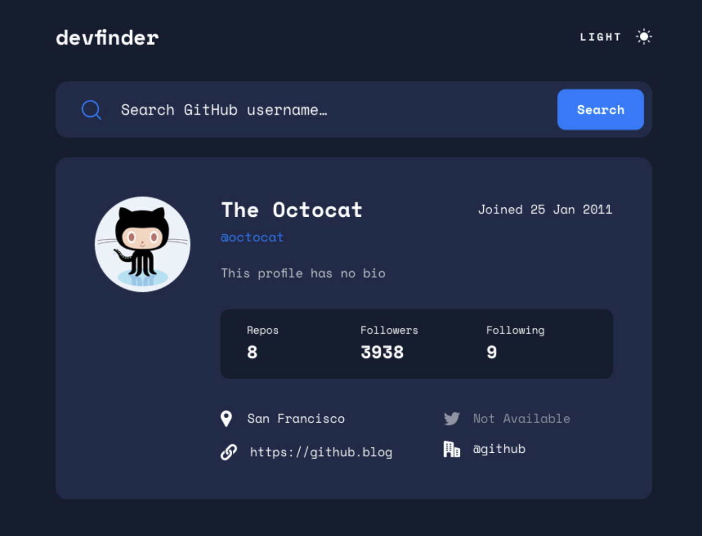

# Getting Started with Create React App

This project was bootstrapped with [Create React App](https://github.com/facebook/create-react-app).

## Available Scripts

In the project directory, you can run:

### `npm start`

Runs the app in the development mode.\
Open [http://localhost:3000](http://localhost:3000) to view it in your browser.

The page will reload when you make changes.\
You may also see any lint errors in the console.

### `npm test`

Launches the test runner in the interactive watch mode.\
See the section about [running tests](https://facebook.github.io/create-react-app/docs/running-tests) for more information.

### `npm run build`

Builds the app for production to the `build` folder.\
It correctly bundles React in production mode and optimizes the build for the best performance.

The build is minified and the filenames include the hashes.\
Your app is ready to be deployed!

See the section about [deployment](https://facebook.github.io/create-react-app/docs/deployment) for more information.

### `npm run eject`

**Note: this is a one-way operation. Once you `eject`, you can't go back!**

If you aren't satisfied with the build tool and configuration choices, you can `eject` at any time. This command will remove the single build dependency from your project.

Instead, it will copy all the configuration files and the transitive dependencies (webpack, Babel, ESLint, etc) right into your project so you have full control over them. All of the commands except `eject` will still work, but they will point to the copied scripts so you can tweak them. At this point you're on your own.

You don't have to ever use `eject`. The curated feature set is suitable for small and middle deployments, and you shouldn't feel obligated to use this feature. However we understand that this tool wouldn't be useful if you couldn't customize it when you are ready for it.

## My Process ##

1) Did a quick google search to find a UI I liked and could build to.

1) Used create React app to build a starter I could build on.  I tidied it up, added theme colors for the light dark mode followed by adding a header to test the light dark mode functionality.
2) I then added a userPage to handle the fetch requests which in turn rendered the User page where I set up a basic display to check the fetch request was working.
3) I added a format date function and test to display the date in a readable format.
4) Next up was to style and layout the user details and bio as per the design.
5) After that I added and styled the followers/repo component
6) I added social media icons and display, modifying the svg files so the color reflected the light/dark mode.
7) Lastly for the User page I added the repository fetch request in the userPage to enable the repos to be displayed on the user page.
8) Then I added the search component
9) I then went back to the user.js file to refactor the code and reshuffle it into other files to make it less cluttered and easier to read.
10) Added some error handling
11) Finally I wrote the App.test.js :)
   

